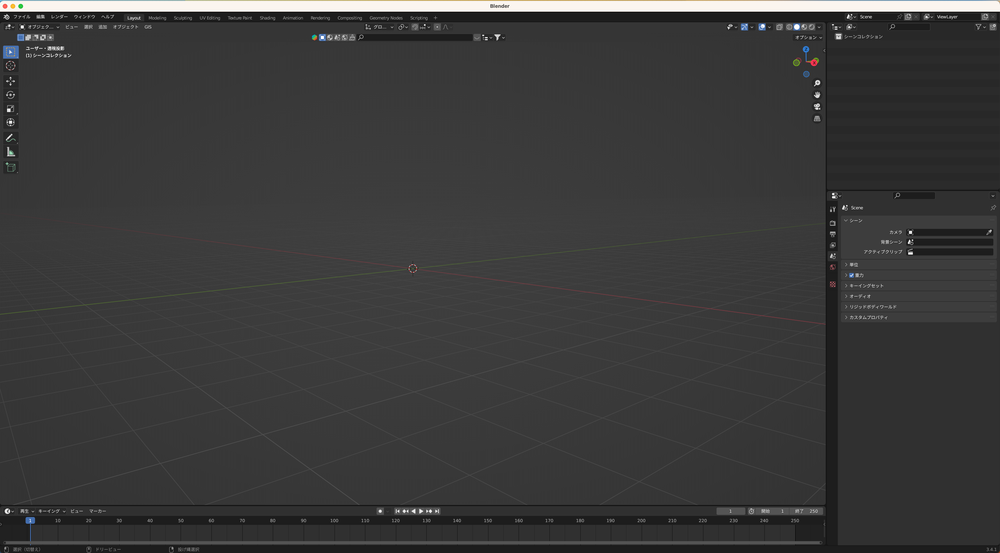
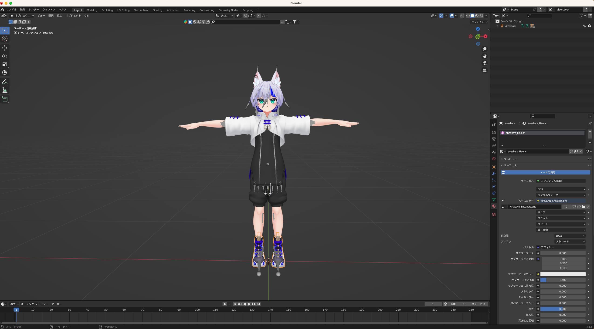
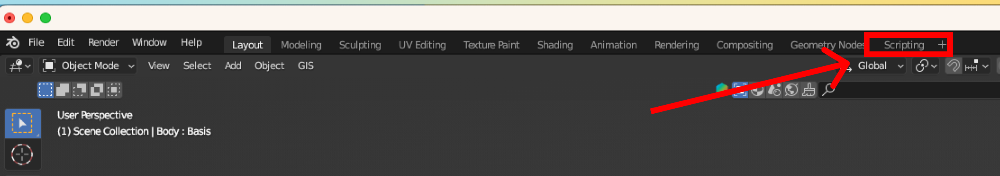
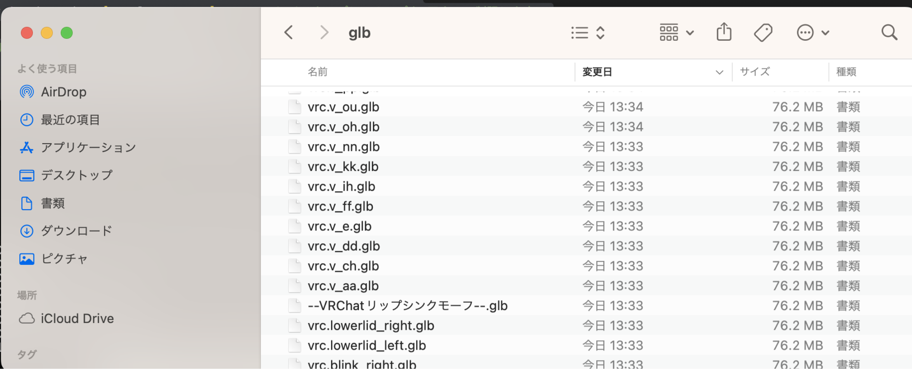
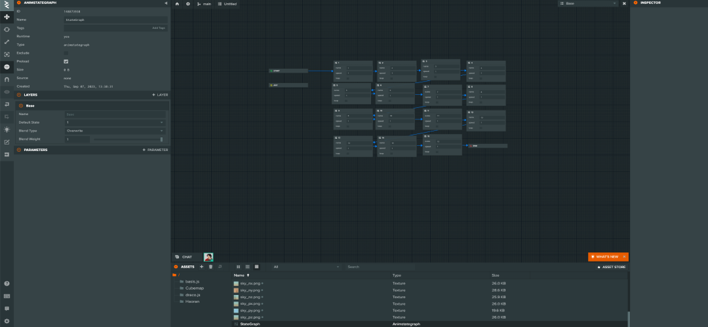
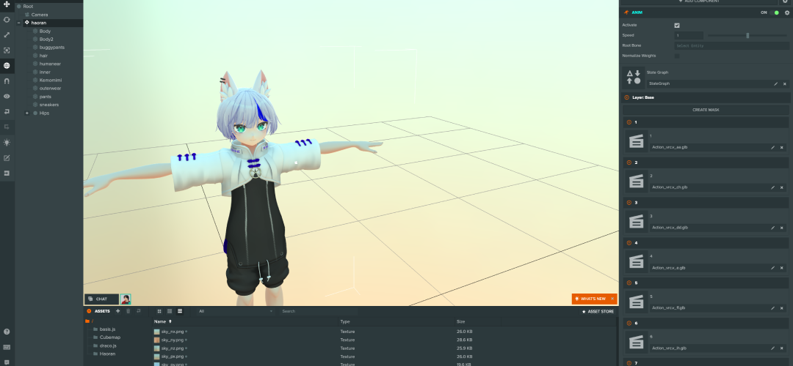

シェイプキーをアニメーション化してGLBとしてエクスポートするBlenderのスクリプトです。アニメーション化をすることで、PlayCanvasのAnimStateGraphでアニメーション制御できるようになります。

## 使い方

### 1. Blenderを開く

動作を確認した環境は、Blender 3.4.1です。



### 2. FBXをインポート



例として、こちらの[3Dモデル](https://booth.pm/ja/items/3818504)をダウンロードしBlenderにインポート。

### 3. スクリプトのビューに切り替え



「Scripting」を選択しビューを切り替えます。

### 4. スクリプトの実行


1. オブジェクトを選択
2. 保存先のディレクトリを設定
3. スクリプトを実行

```python
import bpy

output_dir = "your_directory_path"  # 保存先のパスを設定してください
# オブジェクトを選択します。
obj = bpy.context.object

# シェイプキーのリストを取得します。
shape_keys = obj.data.shape_keys.key_blocks

# シェイプキーの数を指定（現在は30個)
loop_count = min(30, len(shape_keys) - 1)

# 各シェイプキーに対してアニメーションを作成し、GLBとしてエクスポートします。
for key in shape_keys[1:1+loop_count]:  # Basisはスキップし、ループを5回までに制限します。
    
    # 新しいアクションを作成してアサイン
    action_name = f"Action_{key.name}"
    action = bpy.data.actions.new(action_name)
    obj.data.shape_keys.animation_data_create()
    obj.data.shape_keys.animation_data.action = action
    
    # シェイプキーの値をすべて0にリセット
    for k in shape_keys[1:]:
        k.value = 0.0
        k.keyframe_insert(data_path="value", index=-1, frame=0)
    
    # ターゲットとなるシェイプキーのアニメーションを設定
    key.value = 1.0
    key.keyframe_insert(data_path="value", index=-1, frame=24)
    
    # GLBとしてエクスポート
    export_path = f"{output_dir}/{key.name}.glb"  # 保存先のパスを設定してください
    bpy.ops.export_scene.gltf(filepath=export_path, export_format='GLB')
    
    # 作成したアクションを削除
    bpy.data.actions.remove(action)
```


### エクスポート結果




## PlayCanvas

このデータをPlayCanvasにインポートし、AnimStateGraphでアニメーション制御します。





PlayCanvasで設定しているプロジェクトはこちら：

- **プロジェクトURL:** [https://playcanvas.com/project/1135434](https://playcanvas.com/project/1135434)
- **実行URL:** [https://playcanv.as/p/Q7eDemqq/](https://playcanv.as/p/Q7eDemqq/)

### 使用モデル

かなﾘぁさんち 【オリジナル3Dモデル】-ハオラン-HAOLAN [https://booth.pm/ja/items/3818504](https://booth.pm/ja/items/3818504)